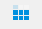

This is a user control to show progress in  terms displaying a  3x3 Block matrix
Each square of the matrix can turm on / off  with fading

## Features
 * animations 
  1. row wise , bottom to top   fade in 
  2. random  fade in , fade out

  